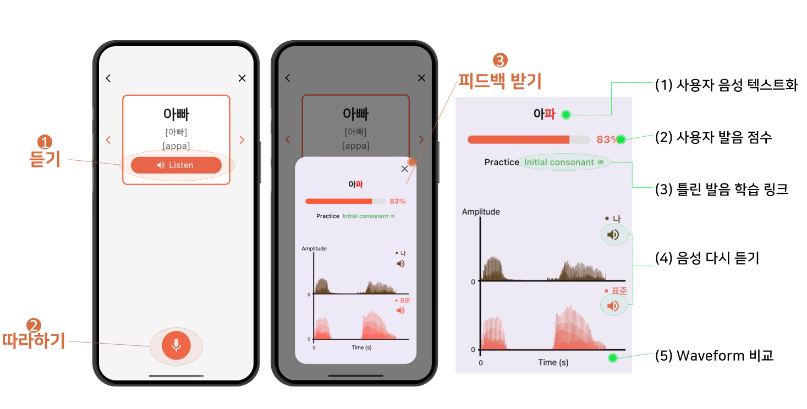
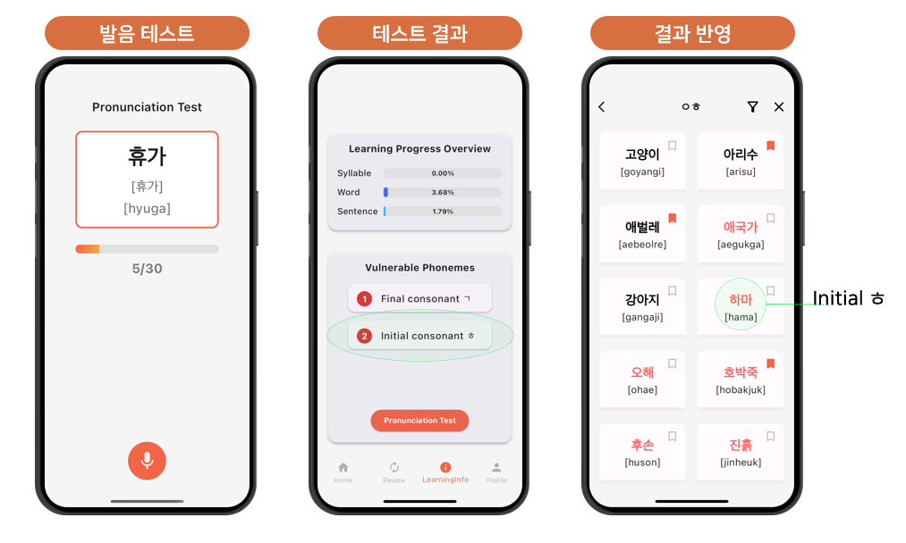
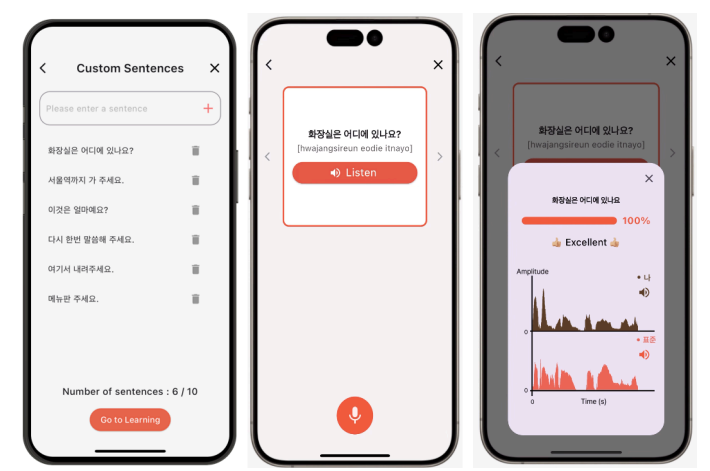
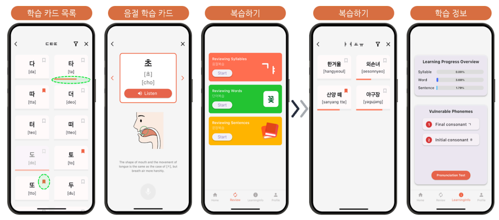
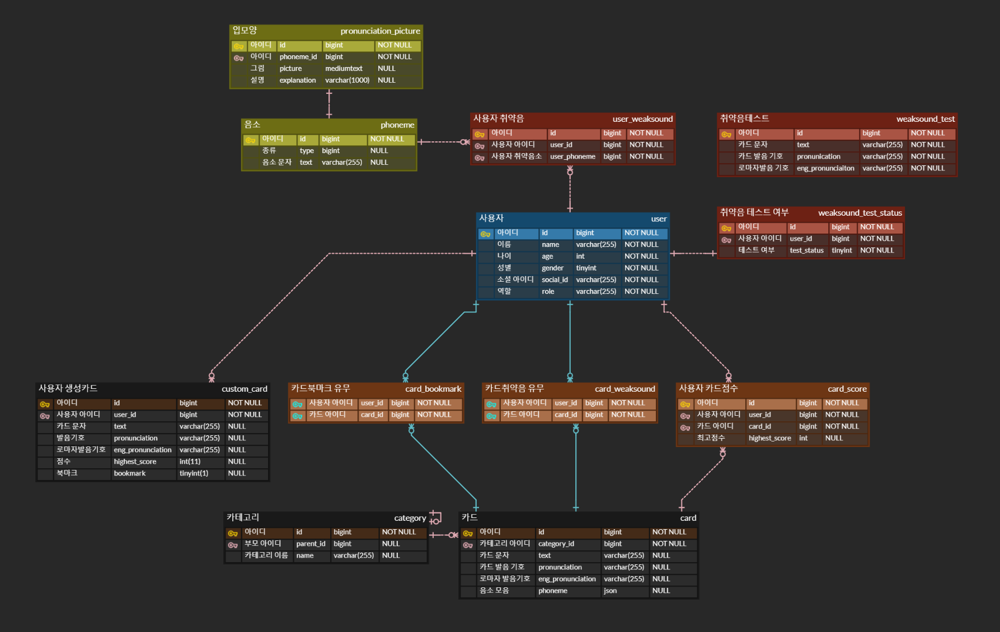
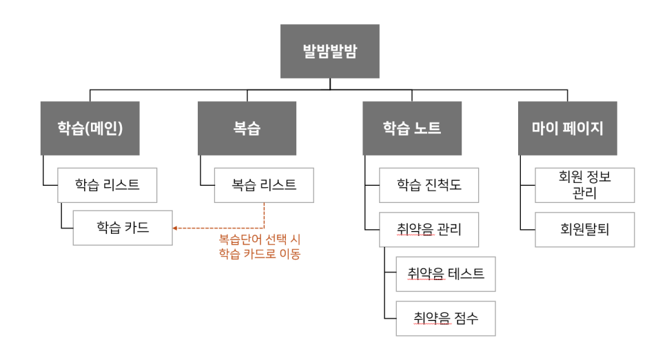
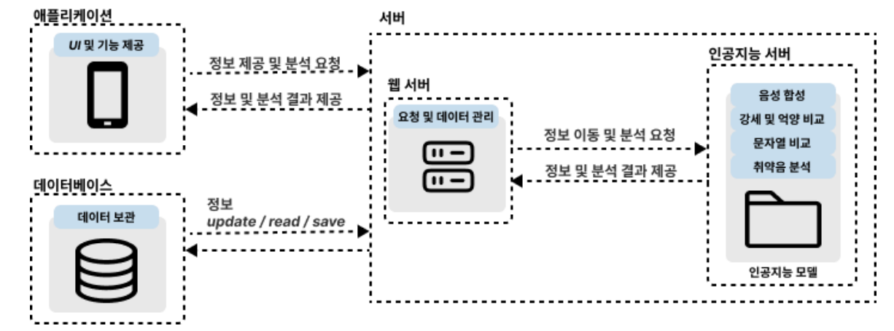

# BalbamBalbam - 외국인을 위한 한국어 발음 교정 시스템

### 배포
7월 Apple App Store에 출시 예정입니다.

&nbsp;
## 프로젝트
### 시연 영상
[🎬 발밤발밤 시연영상](https://www.youtube.com/watch?v=5z-CwNY1Nic)

### 소개
한국어 발음 학습은 **정확한 발음을 듣고 모방하는 것**이 중요합니다.

따라서 발밤발밤은  **<듣기> <따라하기> <피드백 받기>** 의 3단계 학습을 제공하는 애플리케이션입니다.

사용자에게 순차적인 **음절, 단어, 문장** 학습 커리큘럼을 제공하고 

**발음 테스트**와 실생활에서 유용한 상황별 문장들과 **직접 입력한 문장**을 학습할 수 있도록 함으로써, 

사용자의 한국어 발음 능력을 효과적으로 개선시킬 수 있습니다.

&nbsp;

## 기능
### 1. 학습하기
**듣기 - 따라하기 - 피드백받기 의 3단계의 반복을 통한 효과적인 발음 개선**

- **듣기** : TTS로 사용자 연령대, 성별에 따라 6가지의 한국어 발음 음성 제공
- **따라하기** : 듣기를 바탕으로 발음을 따라하기
- **피드백** 받기 : 인공지능을 활용한 5가지 피드백 제공
  
  - 사용자 음성 텍스트화 : Speech-to-Text 모델을 사용
  - 사용자 발음 점수 : 초성, 중성, 종성으로 분리하여 올바른 발음과 사용자 발음 비교
  - 틀린 발음 학습카드 링크 : 틀린 발음에 대해 추가적인 학습이 가능하도록 학습 카드 카테고리 링크 제공
  - 음성 다시 듣기
  - Waveform 비교 : 된소리와 거센소리의 차이를 확인

&nbsp;

### 2. 발음 테스트

**초기 사용자가 자신의 취약 음소를 빠르게 파악**

- 30개 단어 발음 테스트를 통해 최대 상위 4개의 사용자의 발음 취약음을 파악
- 이를 카드 리스트에 표시하여 자신의 취약 음소를 중점적으로 학습

&nbsp;

### 3. 학습 카드 생성
**사용자가 입력한 text로 카드 생성**

- 사용자가 텍스트만을 입력하면, 로마자 발음 표기, 생성된 음성과 함께 학습 카드를 생성
- 기존의 학습 카드와 동일하게 듣기, 따라하기, 피드백 받기의 3단계 과정을 거쳐 학습을 진행

&nbsp;

### 4. 기타 

- 학습 카드 목록
  - 이전 학습의 정확도 점수 프로그래스바로 제공
  - 음절 학습의 경우 입 모양과 발음 설명 제공
- 복습하기
  - 정확도 점수가 100점 미만인 카드 복습 카드 제공
- 학습 정보
  - 음절, 단어, 문장에 따라 학습 진척도 제공

&nbsp;

## Stack

### Backend
- Language : `Java 21`
- Framework : `Spring 6.1.5`, `SpringBoot 3.2.4`, `SpringSecurity`
- OS : `Linux CentOS 7`, `bootJar 배포`
- DB & Data : `MySQL 5.7.44`, `JPA`
- ETC : `Swagger`, `OAuth`

### Front
- Dart
- Flutter

### AI
- Python
- Pytorch

&nbsp;

## 구조도
### ERD

&nbsp;

### 기능 구조도

&nbsp;

### 시스템 구조도

